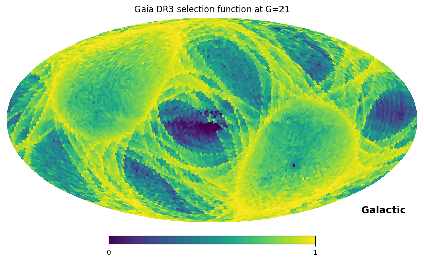

Installation and quickstart
------------

The package is available through PyPI and Github.

To install gaiaunlimited with pip, run:

.. code-block:: bash

   pip install gaiaunlimited

To install gaiaunlimited through github, run:

.. code-block:: bash

   pip install gaiaunlimited@git+https://github.com/gaia-unlimited/gaiaunlimited@<latest release>

Alternatively, clone the repository and install:

.. code-block:: bash

   git clone https://github.com/gaia-unlimited/gaiaunlimited.git
   cd gaiaunlimited
   python -m pip install .

In case a local installation is not possible, the package can also be installed inside a Google Colab notebook by executing the command ``!pip install gaiaunlimited`` or  ``%pip install gaiaunlimited``.

Plotting the Gaia DR3 selection function on the sky
^^^^^^^^^^^^^^^^^^^^^^^^^^^^^

This code queries a precomputed all-sky map and displays the completeness at magnitude 21:

.. code-block:: bash

   from gaiaunlimited.selectionfunctions import DR3SelectionFunctionTCG
   from gaiaunlimited.utils import get_healpix_centers
   import numpy as np
   import healpy as hp
   
   mapHpx7 = DR3SelectionFunctionTCG()
   coords_of_centers = get_healpix_centers(5)
   gmag = np.ones_like(coords_of_centers) * 21.
   completeness = mapHpx7.query(coords_of_centers,gmag)
   hp.mollview(completeness,coord=['Celestial','Galactic'],
               title='Gaia DR3 selection function at G=21',
               min=0,max=1)

Optional: setting the data directory
^^^^^^^^^^^^^^^^^^^^^^^^^^^^^

Gaiaunlimited downloads and caches large binary data files. To set the data directory to store these files,
set the environment variable ``GAIAUNLIMITED_DATADIR`` to the desired location. By default, this will be ``~/.gaiaunlimited``.

.. code-block:: bash

    export GAIAUNLIMITED_DATADIR="/path/to/directory"
